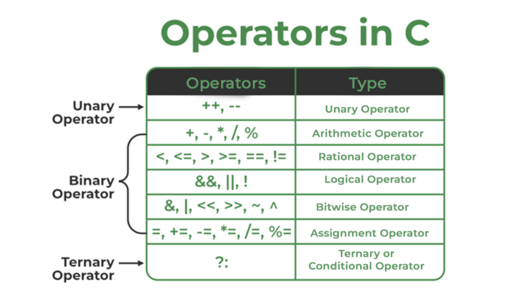

# Introudction
- C is a procedural language.
- C++ is primarily an object-oriented programming (OOP) language, but it also supports procedural programming. This means that C++ is a multi-paradigm language, combining both procedural and object-oriented features, along with other paradigms like generic and functional programming.
- Main differences in C and C++
    - C++ supports OOPs paradigm while C only has the procedural concept of programming.
    - C++ has exception handling capabilities. In C, we have to resolve exceptions manually.
    - There are no references in C.
- C/C++ are **statically typed languages**.
    - This means that the data type of each variable is known at compile time. You must declare the type of every variable (e.g., int, float, char) before you use it, and the type cannot change at runtime.
- In contrast, dynamically typed languages determine the data types of variables at runtime, and variables can change their type during execution (e.g., Python, JavaScript).
- C and C++ are fast because statically typed languages are faster than dynamically typed languages.
- C/C++ are general purpose languages.
    - SQL, HTML, Verilog are not general purpose programming languages.
- Mid, Low, High level languages
    - High level languages
        - Python, Java
    - Mid level languages
        - C, C++
    - Low level languages
        - Assembly languages
        - Machine code
- auto keyword is present in C but is redundant. 
    - auto in C and C++ are completely different.
- qsort() in C
    - ```cpp void qsort(void *base, size_t num, size_t size, int (*compare)(const void *, const void *)); ```

# Contents
1) static libraries and dynamic libraries
    - [Article](https://www.geeksforgeeks.org/static-vs-dynamic-libraries/)
    - [Article](https://www.geeksforgeeks.org/static-and-dynamic-linking-in-operating-systems/?ref=asr2)
2) [Static functions in C](https://www.geeksforgeeks.org/what-are-static-functions-in-c/)
3) [static variables in C](https://www.geeksforgeeks.org/static-variables-in-c/)
    - static variables are initialized with zero, if not explicitly initialized.
    - static variables and global variables are stored in data segment.
4) [Memory layout of C program](https://www.geeksforgeeks.org/memory-layout-of-c-program/)
5) [Printing environment variables in C](https://www.geeksforgeeks.org/c-program-print-environment-variables/)
    - Environment variables are dynamic values that affect the behavior of processes running on an operating system. They provide a way to store configuration information that can be used by both system processes and user applications. These variables are usually used to define system-wide settings, such as file paths, language preferences, and system-specific options, without hardcoding them into scripts or applications.
6) Conversions
    - string to integer
        - atoi and strtol, strtoll: [atoi_strtol.c](atoi_strtol.c)
        - strtol is safer to use.
    - integer to string conversion
        - can be done by using sprintf.
7) printf 
    - [printf.c](printf.c)
    - [GFG Article](https://www.geeksforgeeks.org/printf-in-c/)
8) sprintf
    - [sprintf.c](sprintf.c)
    - sprintf stand for string print.
9) scanf
    - scanf stands for scan fromatted string.
10) format specifiers in C
    - [GFG Article](https://www.geeksforgeeks.org/format-specifiers-in-c/)
11) [enums](https://www.geeksforgeeks.org/enumeration-enum-c/)
    - An enum is a user-defined type that consists of a set of named integer constants.
11.1) Macros
12) extern 
13) [register](https://www.geeksforgeeks.org/understanding-register-keyword/)
14) Operators in C:
    - 

# Operators
- Classification of operators:
    - 
- Operator precedence and associativity: [GFG article](https://www.geeksforgeeks.org/operator-precedence-and-associativity-in-c/)
- Associativity is only used when there are two or more operators of the same precedence.  
    - Only when equal level precedence operators appear in an expression, the associativity comes into picture. For example, f1() + f2() + f3() will be considered as (f1() + f2()) + f3(). But among first pair, which function (the operand) evaluated first is not defined by the standard. 
    - Example: [link](https://www.geeksforgeeks.org/evaluation-order-of-operands/)
- We can use parenthesis to change the order of evaluation.
- All operators with the same precedence have the same associativity.
- Comma as an operator and seperator: [link](https://www.geeksforgeeks.org/comma-in-c/)
- [operators_practise.cpp](operators_practise.cpp)

## Some useful terms:
(NOTE: THE OPERATOR SYMBOLS ARE NOT C OPERATORS, THEY ARE OPERATORS IN MATH TO EXPLAIN CONCEPTS)
- Few properties of operators
    1) Commutativity;
        - An operator is commutative if changing the order of its operands does not change the result.
        - Examples: + and *
            - i.e 2 + 3 = 3 + 2 and  2 * 3 = 3 * 2
        - Non-examples: - and /
            - i.e 2 - 3 not equal to 3-2
            - similarly 2/3  is not equal to 3/2
    2) Associativity
        - An operator is associative if changing the grouping of its operands does not change the result.
        - Examples: + and *
            - i.e (a + b) + c = a + (b + c)
            - similarly (a * b) * c = a * (b * c)
        - Non-examples: - and /
            - i.e (a-b)-c is not same as a-(b-c)
            - similarly (a/b)/c is not same as a/(b/c)
    3) Distributivity
        - An operator is distributive if it can be distributed over another operation.
        - Example: Multiplication is distributive over addition.
            - a×(b+c)=(a×b)+(a×c)
- Identity element
- Inverse element
- Precedence
- Short circuiting

# Strings
- [strings_1.c](strings_1.c)
- [strings_2.c](strings_2.c)
- [Related question](https://www.geeksforgeeks.org/questions/c-pointer-basics-question-15/)
- strcpy
- swapping strings in C: [Article](https://www.geeksforgeeks.org/swap-strings-in-c/)

## Pointers
- A pointer is defined as a derived data type that can store the address of other C variables or a memory location. We can access and manipulate the data stored in that memory location using pointers.
- Nice soruce: [GFG article](https://www.geeksforgeeks.org/c-pointers/)
- Types of pointers
    - integer pointers
    - array pointers:
        - [GFG article](https://www.geeksforgeeks.org/pointer-array-array-pointer/)
    - structure pointers
    - Function pointers
    - Double pointers (or) pointer-to-pointer
        - chain of pointers
    - NULL pointer:
        - [Article on uses of null pointers.](https://www.geeksforgeeks.org/null-pointer-in-c/)
        - Definition of NULL:
            - NULL is defined as <br/> ```cpp #define NULL ((void*)0) ```
            - It represents a pointer that does not point to any valid object or function. The ((void*)0) means a pointer to the memory address 0, which is reserved by most operating systems to indicate an invalid address.
    - Wild pointers:
        - Pointers which are not yet initilized.
        - Playing with wild pointers may lead to crashes and unexpected behaviour.
        - [Article on: What are wild pointers and how we can avoid them](https://www.geeksforgeeks.org/what-are-wild-pointers-how-can-we-avoid/)
    - Void pointers:
        - A void pointer is a pointer that has no associated data type with it. A void pointer can hold an address of any type and can be typecasted to any type.
        - advantages of void*
            - malloc() and calloc() return void * type and this allows these functions to be used to allocate memory of any data type (just because of void *)
    - const pointers
        - [pointers/pointers_9.c](pointers/pointers_9.c)
    - pointers to a constant variable
        - [pointers/pointers_10.c](pointers/pointers_10.c)
- Dangling pointers:
    - [GFG article](https://www.geeksforgeeks.org/dangling-void-null-wild-pointers/)
- size of popinters:
    - The size of the pointers in C is equal for every pointer type. The size of the pointer does not depend on the type it is pointing to. It only depends on the operating system and CPU architecture. The size of pointers in C is 

8 bytes for a 64-bit System
4 bytes for a 32-bit System
The reason for the same size is that the pointers store the memory addresses, no matter what type they are. As the space required to store the addresses of the different memory locations is the same, the memory required by one pointer type will be equal to the memory required by other pointer types.
- function overloading in C
- pointer arithmetic
    - Pointer Arithmetic is the set of valid arithmetic operations that can be performed on pointers.
- Pointers can be outputted using %p, since, most of the computers store the address value in hexadecimal form using %p gives the value in that form. But for simplicity and understanding we can also use %u to get the value in Unsigned int form.
- Array decay, which happens in C and C++.
    - [GFG article](https://www.geeksforgeeks.org/what-is-array-decay-in-c-how-can-it-be-prevented/)
- Usefull stuff:
    - [Question](https://www.geeksforgeeks.org/questions/c-pointers-question-4/)
    - [Question](https://www.geeksforgeeks.org/questions/c-pointers-question-7/)
    - [bug_program_1.c](bug_program_1.c)
    - [stackoverflow](https://stackoverflow.com/questions/47170740/c-negative-array-index), [pointers/pointers_8.c](pointers/pointers_8.c)
        - looking like negative indexing of pointers.
        - it is crazy have a look!!
    - [Question](https://www.geeksforgeeks.org/questions/c-advanced-pointer-question-4/)
    - [Question](https://www.geeksforgeeks.org/questions/gate-gate-cs-2015-set-1-question-45/)
    - [Question](https://www.geeksforgeeks.org/questions/gate-gate-cs-2015-set-3-question-36/)
    - [Question](https://www.geeksforgeeks.org/questions/isro-isro-cs-2017-question-80/)
- Dyamic memory allocation using C
    - [GFG Article](https://www.geeksforgeeks.org/dynamic-memory-allocation-in-c-using-malloc-calloc-free-and-realloc/)
    - malloc, calloc and realloc

# Key words
- Keywords in C: [GFG Article](https://www.geeksforgeeks.org/keywords-in-c/)
- typedef
    - The typedef is a keyword that is used to provide existing data types with a new name. The C typedef keyword is used to redefine the name of already existing data types.
    - pressing question:
        - typedef vs #defines: [GFG article](https://www.geeksforgeeks.org/typedef-versus-define-c/)
    - [typedefs.cpp](typedefs.cpp)

# Value category
- [WIKI](https://en.wikipedia.org/wiki/Value_(computer_science))
- In computer science and software programming, a value is the representation of some entity that can be manipulated by a program. The members of a type are the values of that type.
- Despite its name, in the C++ language standards this terminology is used to categorize expressions, not values.
- Assignment: l-values and r-values
    - An l-value refers to an object that persists beyond a single expression. An r-value is a temporary value that does not persist beyond the expression that uses it.
    - In many languages, notably the C family, l-values have storage addresses that are programmatically accessible to the running program (e.g., via some address-of operator like "&" in C/C++), meaning that they are variables or de-referenced references to a certain memory location.
- Function returning l-value:
    - ```cpp 
        int& func() {
            static int value = 10;
            return value;  // This returns an l-value reference.
        }
        func() = 20;  // The returned reference is an l-value and can be assigned a new value.
       ```

# Side effects
In programming, **side effects** refer to any observable changes in the state of the program or its environment that occur during the execution of a function or expression, beyond returning a value. These changes can affect the global state, modify variables, output to I/O streams, or interact with external systems.

Side effects are typically considered when discussing **pure** versus **impure** functions:
- A **pure function** is one that has no side effects and always produces the same output for the same input.
- An **impure function** may have side effects and thus might behave differently even with the same input.

### Common Side Effects:

1. **Modifying a global or static variable:**
   ```cpp
   int counter = 0;  // Global variable

   void increment() {
       counter++;  // Modifies global state (side effect)
   }
   ```

2. **Modifying the value of a parameter (when passed by reference):**
   ```cpp
   void changeValue(int &x) {
       x = 42;  // Changes the value of the parameter (side effect)
   }
   ```

3. **Performing I/O operations (e.g., printing to the console):**
   ```cpp
   void printMessage() {
       std::cout << "Hello, World!" << std::endl;  // Produces output (side effect)
   }
   ```

4. **Modifying memory via pointers or dynamic allocation:**
   ```cpp
   void allocateMemory() {
       int *p = new int(10);  // Allocates memory (side effect)
       delete p;              // Frees memory (side effect)
   }
   ```

5. **Calling a function that itself has side effects:**
   ```cpp
   void updateGlobal() {
       increment();  // Calls a function that modifies global state (side effect)
   }
   ```

6. **Throwing an exception:**
   ```cpp
   void riskyFunction() {
       throw std::runtime_error("Error occurred");  // Throws an exception (side effect)
   }
   ```

### Example of Pure and Impure Functions:
- **Pure function**:
   ```cpp
   int add(int a, int b) {
       return a + b;  // No side effects, only returns a value
   }
   ```

- **Impure function**:
   ```cpp
   int globalVar = 10;

   int addAndModifyGlobal(int a, int b) {
       globalVar++;  // Side effect: modifies a global variable
       return a + b;
   }
   ```

### Key Side Effects in C++:
- **Modifying non-local variables** (e.g., global variables, static variables).
- **Performing I/O** (e.g., writing to files, printing to the console).
- **Memory management** (e.g., dynamic memory allocation and deallocation).
- **Interaction with hardware** (e.g., reading from sensors, network communication).

Side effects are essential in many programs but can make reasoning about code more difficult since they introduce hidden dependencies and alter the state in ways that aren't always immediately obvious.


# Some questions
- [question_1.png](question_1.png)


<!-- 
- TO DO:
- error handling in C
- operator overloading in C
- variable arguments to functions in C
- pointer arthimetic
-->