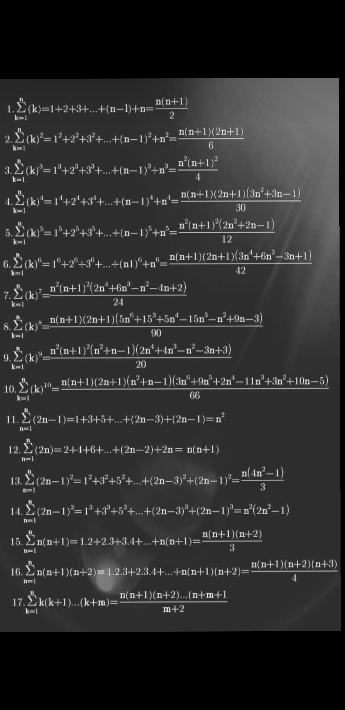

## ✨ Frequently Used Codes

| S.No | Concept | Code | Quick Notes | 
|:--|:--|:---|:---|
| 1️⃣ | Finding the length of a binary format string of a number | [code1.cpp](code1.cpp) | |
| 2️⃣ | Converting numbers in any format (binary, octal, etc.) to decimal | [../C++/string/practise1](../C++/string/practise1) | Uses `stoi()`, `stol()`, `stoll()` for conversion |
| 3️⃣ | Conversion: Binary to Decimal and Decimal to Binary | [../C++/bitset/practise1](../C++/bitset/practise1) | |
| 4️⃣ | GCD and LCM | [euclid_recursive_code.cpp](euclid_recursive_code.cpp), [euclid_iterative_code.cpp](euclid_iterative_code.cpp), [extended_gcd.cpp](extended_gcd.cpp) | **Finding GCD**: Time Complexity: O(log(min(a, b)))   `GCD(a, b) * LCM(a, b) = a * b`   **Euclid's Algorithm**:   `GCD(a, b) = GCD(a - b, b)`   `GCD(a, b) = GCD(a % b, b)` |
| 5️⃣ | Modular Multiplicative Inverse | [modular_multiplicative_inverse.cpp](modular_multiplicative_inverse.cpp) | |
| 6️⃣ | Lucas Theorem | N/A | Useful for finding `(n choose k) % m` when `m` is small and `n` and `k` are large |

## Notes
- **Stirling's Approximation**: 
    - n! ~= sqrt(2 * pi * n) * (n/e)^n
- Sequence and series
    - nth odd number = 2*n - 1
    - Sum of first n positive integers = 1 + 2 + ... + n = n*(n+1)/2
    - Sum of first n squares = 1^2 + 2^2 + 3^2 + ... + n^2 = n*(n+1)(2n+1)/6
    - 

--------------------------------------------------------
### All about primes

- Sieve of Eratosthenes
  - Given integer ‘n’, print all prime numbers <= n. (similar question: [link](https://leetcode.com/problems/count-primes/description/))
    - Algo 1 (GFG) Normal seive
      - [seive_1.cpp](seive_1.cpp)
      - Time : O(nlog(log(n)))
      - Proof of time complexity: [GFG article](https://www.geeksforgeeks.org/how-is-the-time-complexity-of-sieve-of-eratosthenes-is-nloglogn/)
    - Algo 2: Segmented seive
      - [code](segmented_seive.cpp)
      - Segmented sieve is used for better cache, i.e diving into segments, no difference in time complexity, but running time is possibly less than algo1 because algo1 is not cache favored.

- Prime number theorem:
  - Number of primes less than (or) equal to n is =  π(N) ~ n/log(n)
  - Prime counting functuon pi(n) : https://en.wikipedia.org/wiki/Prime-counting_function
- Euclid's theorem: (wiki)
    - There are infinitely many primes. (Infinitude of primes)
- Betrand’s postulate:
    - For all n > 1, there exists at least one prime in (n, 2*n)

- Upper bound on number of factors (This bound is useful for CP)
  - Very useful blog: https://codeforces.com/blog/entry/14463
  - For getting exact bound, see this: https://ideone.com/JNRMsQ
  - n^1/3 is often used bound

- Upper bound on number of prime factors of a number n
  - blog: https://codeforces.com/blog/entry/92148
  - loose upper bound: O(logn)
  - Hardy and Ramanujan proved that "for most numbers" (in the probabilistic sense), the number of distinct prime factors of a number 𝑛 is 𝑙𝑜𝑔(𝑙𝑜𝑔(𝑛))
  - The maximum number of prime factors for a number n <= 1e9 is = 9
  - The maximum number of prime factors for a number n <= 1e18 is = 15

- A well knwon Trial division for prime factorizing a number
  - https://en.wikipedia.org/wiki/Trial_division
  - Time : O(sqrt(n))

- Primegap = gap bertween two consecutive primes
  - [Wiki](https://en.wikipedia.org/wiki/Prime_gap)
  - Primgap gn = pn+1 - pn = O((log(pn)) ^ 2)
  - Notable bound:
    - For any number n <= 1e9, the maximum value of prime gap <= 220
    - For any number n <= 1e18, the maximum value of prime gap <= 1220

----------------------------------------------------------------

- Harmonic number:
    - [Wiki](https://en.wikipedia.org/wiki/Harmonic_number)
    - H(n) = Sum of reciprocals of first n natural numbers = 1 + 1/2 + 1/3 + … + 1/n 
    - H(n) ~ O (lg(n) + γ) 
    - γ = [Wiki](https://en.wikipedia.org/wiki/Euler%27s_constant)
    - See plot of lg(n) + γ vs H(n): [here](harmonic_number.ipynb)

- Pegion hole principle
  - Pegion hole sorting

- Erodos seekers theorem:
  - [WIKI](https://en.wikipedia.org/wiki/Erd%C5%91s%E2%80%93Szekeres_theorem)
  - In mathematics, the Erdős–Szekeres theorem asserts that, given r, s, any sequence of distinct real numbers with length at least (r − 1)(s − 1) + 1 contains a monotonically increasing subsequence of length r or a monotonically decreasing subsequence of length s. 

- \((a + b)² = a² + b² + 2ab\)
- \((a + b)² + (a - b)² = 2(a² + b²)\)

## Probability
- Expected value:
  - [Wiki](https://en.wikipedia.org/wiki/Expected_value)
  The expected value (or expectation) of a **discrete random variable** \( X \) is given by:
  $$
    E[X] = \sum_{x} x P(X = x)
  $$
  For a **continuous random variable** \( X \) with probability density function \( f(x) \), the expected value is:
  $$
    E[X] = \int_{-\infty}^{\infty} x f(x) \,dx
  $$

# Math related CP questions
- [Question 1](https://www.codechef.com/problems/LUCMAT)
- [Random NIM problem](https://www.codechef.com/problems/RANDOM_NIM)

------------------------------------------------------------------------------------------------------------------------
## Fermat's little theorem

- a power m = a mod m, when m is prime number

------------------------------------------------------------------------------------------------------------------------
## MOD

- a = b (mod n) if n divides (a-b)
- (a + b) (mod n) = ((a mod n) + (b mod n)) mod n
- (a * b) (mod n) = ((a mod n) * (b mod n)) mod n
- a = b (mod n) => a ^ i = b ^ i (mod n)

- Important blog : https://codeforces.com/blog/entry/72527

### MOD INVERSE

- (a / b ) % MOD = (a * modInverse(b, MOD)) % MOD
- ((a * b) / (c * d)) % MOD = ((a/c) % MOD) * ((b/d) % MOD) = (((a * b) % MOD) / ((c * d) % MOD)) % MOD
- If m is prime, then inverse of a is (a power (m - 2)) % m
  - this can be proved from fermat's little theorem

------------------------------------------------------------------------------------------------------------------------

## Digital roots
- [WIKI](https://en.m.wikipedia.org/wiki/Digital_root)
- Properties of digital root : [link](https://en.m.wikipedia.org/wiki/Digital_root#Properties)

------------------------------------------------------------------------------------------------------------------------

## Grey codes
https://en.wikipedia.org/wiki/Gray_code

--------

## quadratic equation
ax^2 + bx + c = 0;
- sum of roots = (-b)/a
- product of roots = c/ a
- roots = (-b +- sqrt(b^2 - 4ac)) / 2a

-----------

## Divisor function

- WIKI : https://en.wikipedia.org/wiki/Divisor_function
- Very useful blog and comments: https://codeforces.com/blog/entry/14463
  - See this for bound: https://ideone.com/JNRMsQ
- Related problem : https://www.codechef.com/problems/BNSONSTR

-----------
## Functions and 

- Number of functions from A to B. (|A| = n, |B| = m) = m power n
- Number of one-one functions = m * (m-1) * .. (m - n + 1)
- Number of onto functions = m power n - (number of non-onto functions), See [Inclusion and exclusion principle](https://en.wikipedia.org/wiki/Inclusion%E2%80%93exclusion_principle).

- [Inclusion and exclusion principle](https://en.wikipedia.org/wiki/Inclusion%E2%80%93exclusion_principle)
- Number of elements x such that x belongs to atleast sets A1, A2, ..., An = | A1 U A2 .. U An|
- Number of dearrangments

- [question](https://www.codechef.com/problems/PERMUTATION2)

-----------

## Bitwise operators

- [Wiki](https://en.wikipedia.org/wiki/Bitwise_operation)
- (a + b) = ((a & b) << 1) + (a ^ b)

