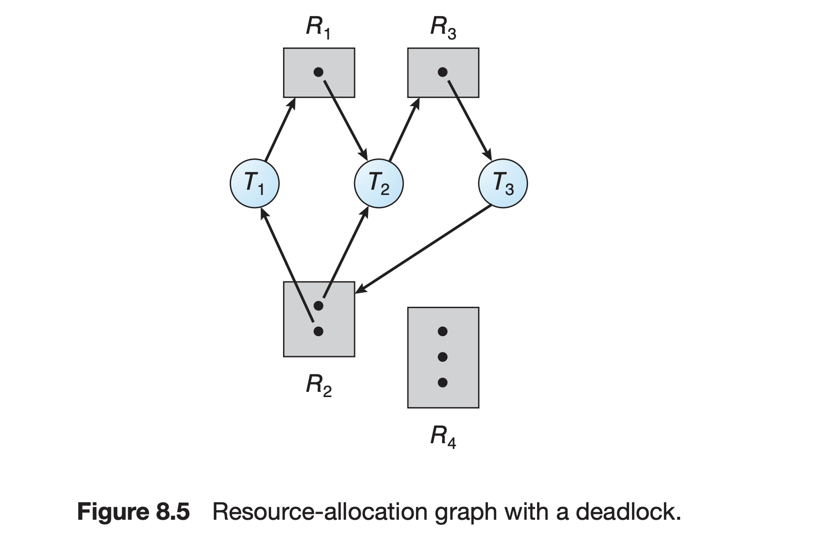
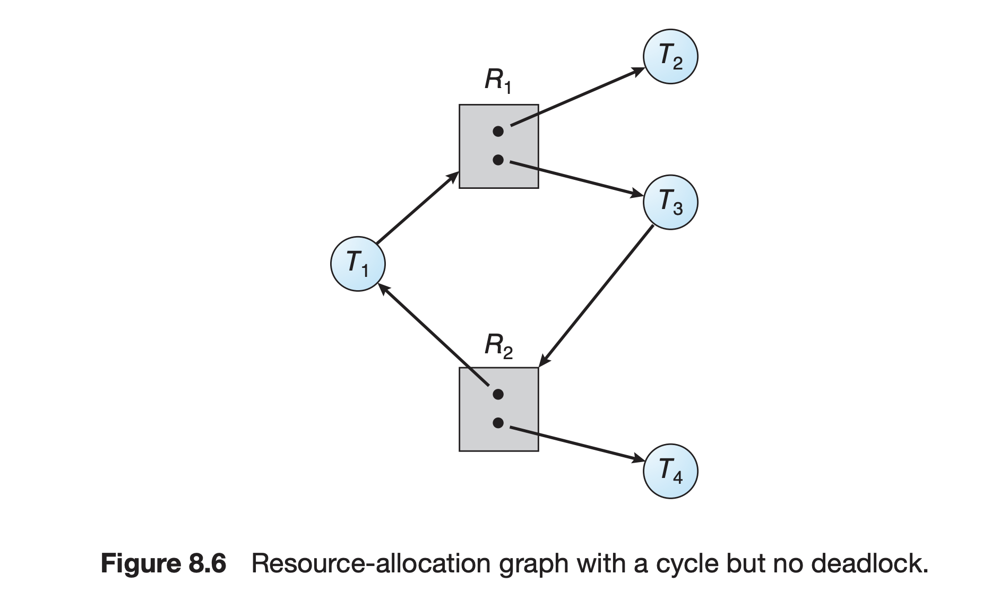
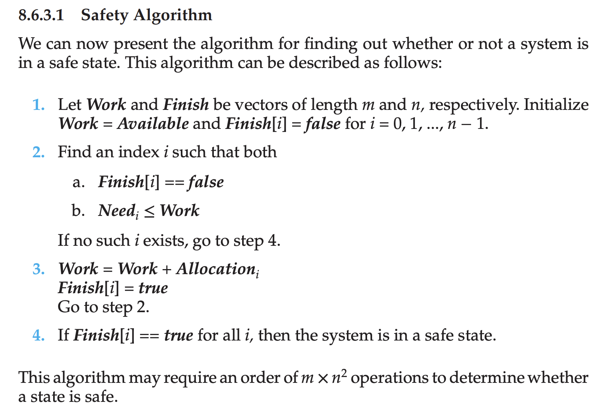
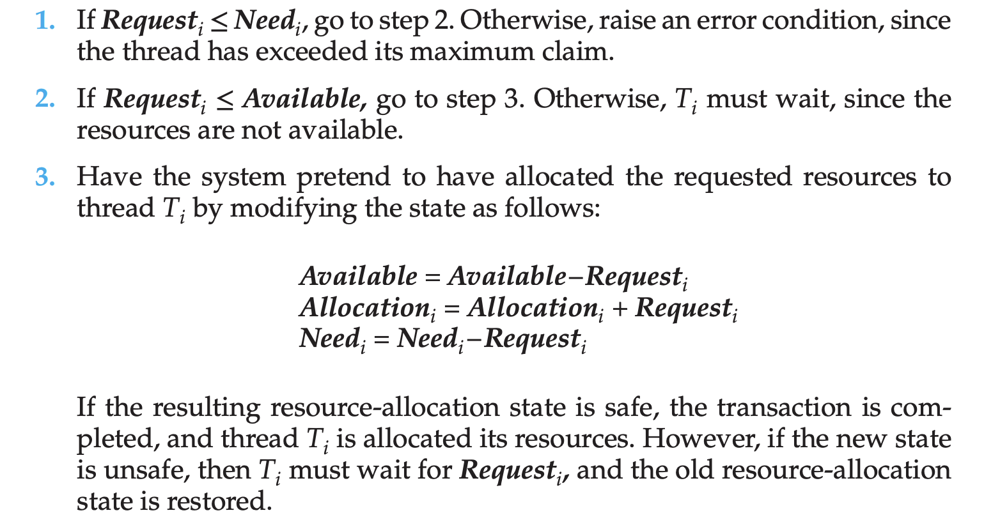

# OS

- Real time OS
    - A real-time operating system (RTOS) is a special kind of operating system designed to handle tasks that need to be completed quickly and on time. Unlike general-purpose operating systems (GPOS), which are good at multitasking and user interaction, RTOS focuses on doing things in real time.
- OS is a software that manages system hardware.
- Some important features of OS
    1) Resouce management
    2) Process management
    3) Storage management (File management on disk)
    4) Memory management
    5) Security management
- Two basic components of OS
    1) Shell
        - A program which provides a communication platform for users to use hardware.
        - Shell is an interactive program that communicates with the user through the terminal and with the OS through system calls.
    2) Kernel
        - Kernel is the core component of OS, which is responsible for handling various features such as: process managmenet, memory managmenet, disk managment, IPC etc.
        - The kernel is a computer program at the core of a computer's operating system and generally has complete control over everything in the system. The kernel is also responsible for preventing and mitigating conflicts between different processes. It is the portion of the operating system code that is always resident in memory and facilitates interactions between hardware and software components.
        - A kernel loads first into memory when an operating system is loaded and remains in memory until the operating system is shut down again. 
        - The rest of the components in OS depends on kernel for the supply of the important services that are provided by OS.
        - Types of kernel
            1) Monolithic kernel
                - A monolithic kernel is a single large process running entirely in a single address space, containing all core services like process management, memory management, file systems, and device drivers.
                - Examples: linux, windows earlier versions
            2) Micro kernel
                - A microkernel is a minimalistic kernel that includes only essential functions such as inter-process communication and basic memory management, with other services running in user space.
            3) Hybrid kernel
                - A hybrid kernel combines aspects of both monolithic and microkernels, running some services in kernel space and others in user space, to balance performance and modularity.
                - Examples: Windows (newer versions), 
- OS vs kernel
    - OS = Kernel + User-level components
        - User-level components:
            - The OS includes various components that operate in user space—outside the kernel. These provide higher-level functionality for the user and applications:
                1) System libraries: These are collections of utilities that provide standard functionalities like file handling, string manipulation, etc. (e.g., libc on Unix systems). They act as intermediaries between applications and the kernel.
                2) User interface (shell): The command-line interface (CLI) or graphical user interface (GUI) that users interact with. Common shells include:
                    - Bash, Zsh (CLI)
                    - GNOME, KDE (GUI)

- **Popular OS**
    - Linux based OS:
        - Strictly speaking linux is not a OS. Linux is a kernel.
        - However, when people say "Linux," they often refer to Linux-based operating systems, also known as distributions or distros, which bundle the Linux kernel with other software to create a complete OS.
        - Some examples of linux distributions that use the linux kernel but package it with additional software, user interfaces, and applications to form a complete OS are:
            - Ubuntu
            - Debian
            - Fedora
            - CentOS
            - Kali linux
            - Linux mint
        - sudo stands for "superuser do." It allows a permitted user to execute a command as the superuser (root) or another user.
        - GNOME
            - GNOME is a popular desktop environment for Linux and other Unix-like operating systems. It provides a user-friendly graphical interface with a focus on usability, customization, and accessibility.
            - Think of it as the "face" of your computer, providing the visual elements and tools you interact with.
        - SSH (secure shell)
            - A protocol used to securely connect to remote servers via the command line. The ssh command initiates an encrypted connection between a client and server.
            - SSH replaced telnet: SSH (Secure Shell) encrypts data during transmission, providing a secure channel over an unsecured network, while Telnet transmits data in plain text, making it vulnerable to eavesdropping and attacks.
        - shell vs terminal
            - shell:
                - The shell is a command-line interpreter that provides a user interface for accessing the services of the operating system. It interprets user commands and communicates with the kernel to execute those commands.
                - Examples:
                    1) Bash (In linux (or) unix)
                    2) Zsh (In macOS)
            - terminal:
                -  A terminal is a physical or virtual interface that allows users to interact with the shell. It serves as a window where users can input commands and view output.
                - Allows users to enter commands and displays text output from the shell.
        - grep:
            - A command used to search for specific patterns or text within files or output.
            - grep commands:
                - grep "keyword" file_name
                    - searches for "keyword" in file whose name is file_name.
                - grep -i "keyword" file_name
                    - ignores case when searching
                - grep -n "keyword" file_name
                    - Displays line numbers along with matching lines.
                - grep -c "keyword" file_name
                    - Counts the number of lines which has "keyword".
                - grep -r "pattern" directory/
                    - Searches for "pattern" in all files within a directory and its subdirectories.
                - grep -E "regular_expressions" file_name
                    - grep -E "a.b" filename
                        - Matches lines containing "a" followed by "b".
                    - grep -E "a+b+" filename
                        - This matches lines which has pattern one or more "a"s followed by one or more "b"s.
                    - grep -E "ab*" filename
                        - This matches line which has pattern one 'a' followed by one (or) more 'b's
        - mount
            - "Mounting" refers to the process of making a storage device (such as a hard drive, SSD, USB drive, or network storage) accessible to the system by associating it with a directory (mount point).
            - When you mount a file system, the operating system can read and write data on the storage device. Without mounting, the OS doesn't have access to the device.
            - A mount point is the directory where the file system is made accessible. For example, / is the root directory, and various other file systems or devices are mounted at different directories.
            - Commands:
                - mount 
                    - When you run the mount command, you're essentially listing all the file systems and devices that are currently "mounted" and available for the operating system to access.
        - man
            - The command to display documentation about other Linux commands. For example, man ls shows the manual for the ls command.
        - script
            - A file containing a series of commands that can be executed as a program. Typically, shell scripts end with .sh and can be run using bash script.sh.
            - echo 
                - Built in command in shell scripting.
                - echo "Hello, World!" will print "Hello, World!" to the terminal.
        - Tar files
            - A tar file is an archive file format used to combine multiple files and directories into a single file for easier storage and transfer. The term "tar" stands for "tape archive," as it was originally developed for storing files on magnetic tape.
            - File Extension: Tar files typically have the .tar extension. Compressed tar files often have extensions like .tar.gz or .tar.bz2.
            - Why tar files are use:
                1) Compiling multiple files and directories into one file, simplifying file organisation, management and transfer.
                2) Commonly used for data backup and long-term storage(archiving) as it preserves the original structure.
                3) Compression: When combined with compression algorithms (like gzip or bzip2), tar files can significantly reduce file sizes.
            - Commands:
                - tar -cvf archive.tar /path/to/directory
                    - create a tar file
                - tar -xvf archive.tar
                    - extract a tar file
                - tar -czvf archive.tar.gz /path/to/directory
                    - create a compressed tar file
                - tar -xzvf archive.tar.gz
                    - extract a compressed tar file
        - Listing:
            - commands
                - ls
                    - list all files and directories in current directory.
                - ls directory_path
                    - list all files and directoreis in directory with the correspoding path.
                - ls -a
                    - lists all hidden files (those starting with dot)
                - ls -l
                    - display detailed info about files
                - ls -R
                    - lists all file and directories recursively
                - ls -i 
                    - lists the inode indices of all files and directories in current directory
                    - stat file_name
                        - to get more details in inode entry of the file.
        - Remove
            - rm
                - rm file_name
                    - Removes file with name file_name in current 
                - rm -r dir
                    - Removes directory recursively
        - copy
            - cp orginal_file copied_file
                - copy the contents of file
        - mkdir
            - mdir dir
                - create directory dir in current directory.
        - cd
            - cd ..
                - go to parent directory of current direcotry.
        - ps
            - The ps command provides a snapshot of currently running processes at the moment it is invoked. It does not update in real-time; you must run it again to see changes.
        - top
            - The top command provides a real-time, dynamic view of the system's processes. It updates the display continuously, allowing you to see process activity as it happens.
        - Root Filesystem (/)
            - The root filesystem is the primary filesystem that contains the top-level directories like /bin, /etc, /home, /usr, etc., which are essential for the system's functionality.

- Types of OS
    1) Batch OS (Batch processing systems)
        - A Batch Operating System is an early type of operating system where tasks (jobs) are collected (batched) and processed together without any user interaction. Programs or jobs are submitted to the system in batches, and the operating system processes them sequentially, one after the other.
        - No direct interaction with the user: Once the job is submitted, the user doesn't interact with it until the entire job is processed.
        - Job Scheduling: Jobs are scheduled in batches, often using First-Come, First-Served (FCFS) or priority-based scheduling.
        - Reduced idle time: Since jobs are processed in batches, it reduces CPU idle time by efficiently handling the execution of multiple jobs.
        - I/O Bound Operations: Input/output operations were often slower than CPU execution, so the batch system was used to queue up jobs, allowing the CPU to stay busy while waiting for I/O.
    2) Multi-programming OS
        - Multi programming is pseduo parallelsim
    3) Multi-processing OS
        - A multiprocessing operating system is defined as a type of operating system that makes use of more than one CPU to improve performance. Multiple processors work parallelly in multi-processing operating systems to perform the given task. 
        - Multi processing is true parallelsim.
- Must read article for comparision among multi-programming, multi-procesing, multi-tasking and multi-threading: [GFG article](https://www.geeksforgeeks.org/difference-between-multitasking-multithreading-and-multiprocessing/)
- [Spooling](https://www.geeksforgeeks.org/what-exactly-spooling-is-all-about/)
- A bus is a communication system that transfers data between components of a computer, like the CPU, memory, and peripherals.
- Address bus:
    - Purpose: Used to specify the memory location or I/O device where data is to be transferred.
    - Function: Carries the memory address or I/O device address to the appropriate component.
    - Width: The width of the address bus determines the maximum amount of memory or I/O devices that can be addressed. For example, a 16-bit address bus can address 2^16 = 65,536 memory locations or I/O devices.
- Data Bus:
    - Purpose: Used to transfer data between the CPU, memory, and I/O devices.
    - Function: Carries data to and from the CPU, memory, and I/O devices.
    - Width: The width of the data bus determines the amount of data that can be transferred in a single cycle. For example, a 32-bit data bus can transfer 32 bits of data at a time.
- Control bus:
    - Purpose: Used to control the operation of the CPU, memory, and I/O devices.
    - Function: Carries control signals that determine the timing and sequence of operations.
    - Signals: Common control signals include read, write, clock, interrupt, and reset.
- System bus:
    - Purpose: A collection of buses that connects the CPU, memory, and I/O devices.
    - Components: Typically consists of an address bus, a data bus, and a control bus.
    - Function: Enables communication and data transfer between the various components of the computer system.


# Definitions
- UI and UX
    - UI:
        - UI is about what the user sees and touches.
        - A website with a clean, intuitive layout and clear navigation is a good UI.
        - UI include compoents like: Buttons, icons, typography, color schemes, layouts, and more.
    - UX:
        - UX is about how the user feels while using the product.
        - A website that is easy to use, meets the user's needs, and provides a satisfying experience is a good UX.
        - UI is a subset of UX.
        - UI focuses on aesthetics and usability, while UX focuses on the entire user journey.
- Embedded systems are specialized computing systems designed to perform dedicated functions or tasks within a larger system. Unlike general-purpose computers, which can run a variety of applications, embedded systems are typically optimized for specific applications and have constraints on resources such as power, memory, and processing speed.
- In computing, the term "spawns" refers to the process of creating a new child process from an existing parent process. The parent process uses a system call (like fork() in Unix/Linux) to create a duplicate of itself, which becomes the child process. The child process can then execute a different program (using system calls like exec()), such as a shell or a login prompt.


## CPU scheduling algorithms
- Non-Preemptive Scheduling Algorithm
    - In non-preemptive scheduling, once a process is given the CPU, it runs to completion or until it voluntarily releases the CPU (e.g., by completing execution or waiting for I/O).
    - The running task has full control of the CPU until it finishes or yields.
- Preemptive Scheduling Algorithm
    - In preemptive scheduling, the CPU can be taken away from a process if a higher-priority process arrives or after a certain time interval (time quantum in case of round-robin scheduling). The running process is interrupted and moved back to the ready queue.
    - The OS has control over the CPU and can stop a running task before it completes, switching to another task.
- In general:
    - Preemptive Scheduling algorithm: In the preemptive scheduling algorithm if more than one process wants to enter into the critical section then it will be allowed and it can enter into the critical section without any interruption only if no other progress is in the critical section.
    - Non-Preemptive scheduling algorithm: If a process gets a critical section then it will not leave the critical section until or unless it works gets done.

## Booting the computer
- Important question: What happens when we turn on a computer? 
- Must read article:  [Boot block in OS](https://www.geeksforgeeks.org/boot-block-in-operating-system/)
**Booting** is the process of starting or restarting a computer by loading the operating system (OS) into the computer’s memory (RAM) from a storage device (like a hard drive, SSD, or CD). This process prepares the system for user interaction by initializing hardware components and launching the OS.

There are two types of booting:
1. **Cold Booting (Hard Booting):** When the computer is turned on from a completely powered-off state.
2. **Warm Booting (Soft Booting):** When the system is restarted without fully turning off the power (e.g., using the "Restart" option in an operating system).

### Steps in the Booting Process (Unix based systems)
- Bootstrap is a term that refers to the process of starting a system or a software environment from a minimal set of resources. It originally comes from the phrase "pulling oneself up by one’s bootstraps," meaning to start something without external help.
    - In the context of OS: It is the process by which a computer system initializes itself and loads the operating system into memory from a powered-off state.

1. **BIOS (or) UEFI intilization**
    - BIOS (or) UEFI is the first code that runs when you power on your machine.
    - It performs basic system initialization, including hardware checks (Power-On Self-Test or POST which tests the hardware coponents like RAM, CPU, and other storage devices) and boot device identification.
    - BIOS looks for a bootable device (e.g., hard drives, USB or CDs), locates the **bootloader** on bootable device and hands over the control to bootloader.
2. **Bootloader (GRUB/LILO)**
    - The bootloader is a small program that loads the kernel into memory.
    - GRUB (GRand Unified Bootloader) is the most commonly used bootloader for Linux.
        - GRUB loads its configuration file (/boot/grub/grub.cfg) and presents a boot menu to the user.
        - The user can choose which kernel to boot if multiple kernels are installed.
        - After the selection, GRUB loads the selected kernel and an initial RAM disk (initramfs) into memory.
        - initramfs is a temporary root filesystem loaded into memory by the bootloader. It contains essential drivers and scripts required to mount the real root filesystem (e.g., from a hard disk or SSD).
        - Once the real root filesystem is mounted (mounted to '/), the kernel transitions to the actual operating system environment.
    -  **Windows Boot Manager (BOOTMGR):** Used in Microsoft Windows systems to start the Windows OS.
        - Note that windows boot manager does not give a option to show which kernel to use for a user.
3. **Kernel initilization**
    - The Linux kernel is loaded into memory and starts executing.
    - The kernel initializes the hardware (such as CPU, memory, and storage devices) and mounts the root filesystem.
    - The kernel also loads drivers required to access the system's hardware.
    - After mounting the root filesystem, the kernel launches the init process as the first user-space process (with Process ID 1).
    - Traditionally, init is the parent of all processes and is responsible for initializing user-space services.
    - Getty: As part of its initialization tasks, init (or systemd) starts the Getty process, which is responsible for presenting a login prompt on the console (tty).
    - Login: The Getty process spawns the login process, which authenticates users. When you enter your credentials at the login prompt, the login process handles the validation.
    - User Shell: After successful authentication, the login process spawns the user's shell (such as bash, zsh, etc.), and the user can begin their session.

### Cold Boot vs. Warm Boot:
- **Cold Boot:** Starting the computer from a powered-off state.
- **Warm Boot:** Restarting the system without turning off the power (like pressing the restart button or using software commands).

# Inter process communication
**Inter-Process Communication (IPC)** allows processes to communicate and synchronize their actions in a multitasking environment. Here’s a brief overview:

### Key IPC Mechanisms

1. **Pipes**: 
   - **Anonymous Pipes**: Unidirectional communication between parent and child processes.
   - **Named Pipes (FIFOs)**: Bidirectional communication between any two processes using a named channel.

2. **Message Queues**: 
   - Asynchronous communication where messages are sent to a queue and read in FIFO order.

3. **Shared Memory**: 
   - A common memory segment accessed by multiple processes for fast communication, requiring synchronization (e.g., with semaphores).

4. **Semaphores**: 
   - Synchronization tools to control access to shared resources, preventing race conditions.

5. **Sockets**: 
   - Communication over a network, suitable for processes on the same or different machines, supporting TCP (stream-oriented) and UDP (datagram-oriented).

6. **Signals**: 
   - Notifications sent to processes for events (e.g., termination requests), but limited in data transfer.

### Choosing IPC Mechanisms
- **Data Size**: Shared memory for large data; pipes and message queues for smaller messages.
- **Directionality**: Pipes for unidirectional; sockets or message queues for bidirectional.
- **Performance vs. Complexity**: Shared memory is fastest but complex; sockets are flexible for network communication.

### Challenges
- **Synchronization Issues**: Can lead to race conditions and deadlocks.
- **Performance Overheads**: Introduced by context switching and system calls.
- **Security**: Preventing unauthorized access to shared resources is critical.

# Memory
- An **Address Bus** is a crucial component in a computer system that carries the memory addresses from the processor (CPU) to other components, such as RAM or I/O devices. It is used by the CPU to specify the location of data or instructions that need to be read from or written to in memory.
- Types of memory
    1) RAM 
        - volatile
        - faster
        - expensive
        i) DRAM
        ii) SRAM
    2) ROM
        - non volatile
        - slower
        - cheaper
        i) PROM
        ii) EPROM
        iii) EEPROM
- Memory mapped IO vs isolated IO: [GFG article](https://www.geeksforgeeks.org/memory-mapped-i-o-and-isolated-i-o/)
- A **page fault** occurs when a process attempts to access data or code that is in its address space but is not currently located in the system RAM. This triggers a sequence of events where the operating system must manage the fault by loading the required data from secondary storage into RAM.
    - Page replacement becomes necessary when a page fault occurs and no free page frames are in memory.
    - Paging
-------
## Detection of page fault
A page fault is detected by the operating system (OS) when a process tries to access a page of memory that is not currently mapped in its address space. Here's how the detection process typically works:

### Steps in Page Fault Detection:

1. **Accessing Memory**:
   - When a program accesses memory (e.g., reading from or writing to a variable), the CPU generates a memory address.

2. **Translation Lookaside Buffer (TLB)**:
   - The CPU first checks the **TLB**, a cache that stores recently used virtual-to-physical address mappings. If the translation is found in the TLB, the corresponding physical address is used, and the access continues without any issue.

3. **Page Table Lookup**:
   - If the TLB does not have the mapping (a TLB miss), the CPU then accesses the **page table** for the process. The page table contains the mapping of virtual addresses to physical addresses.

4. **Page Table Entry (PTE) Status**:
   - Each entry in the page table (Page Table Entry, PTE) has a status bit indicating whether the page is in physical memory or not:
     - **Present Bit**: If this bit is set, it means the page is currently loaded in physical memory.
     - **Not Present Bit**: If this bit is not set, it indicates that the page is not in physical memory.

5. **Page Fault Trigger**:
   - If the access results in a PTE with the **not present** bit (indicating the page is not currently in RAM), a **page fault** is triggered.

6. **Page Fault Handler**:
   - The operating system's page fault handler is invoked to handle the page fault. The handler typically:
     - Determines the cause of the page fault (e.g., whether it was a valid access or an invalid access).
     - If it's a valid access, the handler will find the needed page (from disk or other storage) and load it into memory.
     - Updates the page table with the new mapping.
     - Restarts the instruction that caused the page fault.

### Summary:
Page faults are detected when a process tries to access a page not currently in physical memory. The detection process involves checking the TLB and the page table, leading to the invocation of a page fault handler if the page is not present in memory.
-----------
- [Page replacement algo](https://www.geeksforgeeks.org/page-replacement-algorithms-in-operating-systems/)
    - FIFO
    - Optimal page replacement
    - LRU
        - LRU is also used as cache replacement algorithm
        - [Question](https://leetcode.com/problems/lru-cache/submissions/1404037372/)
        - [LRU_without_dummies.cpp](LRU_without_dummies.cpp) is complex as no dummies are used.
            - Time: O(1) per operation
            - Auxillary space: capacity * 2 
        - [LRU_simple.cpp](LRU_simple.cpp) is simplified by using dummies
            - Time: O(1) per operation
            - Auxillary space: capacity * 2 
    - MRU
- Demand paging

- Virtual memory is a combination of RAM and disk space that running processes can use. Swap space is the portion of virtual memory that is on the hard disk, used when RAM is full. 

- Two main types of virtual memory managment
    1) paging
    2) Segmentation
        - Segmentation is a memory management technique that divides a program into segments, improving performance and reducing internal fragmentation.
        - Segments are not of equal size and are loaded into memory at runtime
- Virtual memeory
    - Virtual memory is a memory management technique that creates an "abstraction" of the physical memory available in a system. It allows a computer to use hard disk space as if it were additional RAM, enabling larger applications to run on systems with limited physical memory.
- Physical memory refers to the actual RAM (Random Access Memory) installed in a computer system. It is the hardware that stores data and instructions currently in use.
- Page table 
    - A data sturcture used to get the physical address of logical address. 
    - Page tables are typically stored in main memory (RAM). Each process has its own page table that keeps track of the mapping for its virtual address space.
    - Pointer in PCB: The Process Control Block (PCB) of each process contains a pointer (base address) to the page table of that process, allowing the operating system to quickly access the page table during context switches.
    - During context switching, the OS updates the page table base register PTBR (in the CPU) with the address of the new process's page table from its PCB.

- PTE:
    - A Page Table Entry (PTE) is an entry in the Page Table that stores information about a particular page of memory. Each PTE contains information such as the physical address of the page in memory, whether the page is present in memory or not, whether it is writable or not, and other access permissions.
- TLB
    - Translation Lookaside buffer
    - Is a fast cache used to store page table entries.


-----

Fragmentation is a phenomenon that occurs in computer memory management where free memory space becomes divided into small, non-contiguous blocks, making it difficult to allocate larger contiguous blocks of memory. There are two main types of fragmentation: **external fragmentation** and **internal fragmentation**. Let's delve into both, especially in the context of paging:

**1. External Fragmentation**
- **Definition**: External fragmentation happens when there is enough total free memory available to satisfy a memory request, but the available memory is not contiguous. This results in many small gaps in memory that cannot be used effectively.
- **Example**: If you have free memory blocks of sizes 10 KB, 5 KB, and 15 KB, and you need a 20 KB block, you cannot allocate the memory, even though the total free memory (30 KB) is sufficient.

**2. Internal Fragmentation**
- **Definition**: Internal fragmentation occurs when a fixed-size memory block is allocated to a process, but the process does not use the entire block. The unused space within the block becomes wasted.
- **Example**: If a process requests 18 KB of memory and the system allocates a 20 KB block (the smallest block available), there will be 2 KB of internal fragmentation because that space is not utilized.

### How Paging Reduces Fragmentation
Paging is a memory management technique that helps mitigate fragmentation issues in the following ways:

- **Fixed-Size Pages**: In paging, memory is divided into fixed-size pages (usually between 4 KB and 64 KB). When a process is loaded into memory, its pages are mapped to available physical memory frames, which can be non-contiguous. This means that processes can be allocated memory in a more flexible manner, helping to reduce external fragmentation.

- **Avoiding Large Contiguous Allocations**: Since the pages can be scattered throughout physical memory, the operating system does not require large contiguous blocks of memory, which helps alleviate the issue of external fragmentation. 

- **Minimizing Internal Fragmentation**: Although internal fragmentation can still occur with paging (for instance, if a page is not completely filled), it is often minimized since the page size is chosen to balance between overhead and efficient usage of memory. The overall effect is that paging can result in less wasted memory than other methods, like segmentation, which uses variable-sized memory blocks.

- **Paging** effectively reduces external fragmentation by allowing non-contiguous allocation of pages and minimizes internal fragmentation through the use of fixed-size pages.
- By using paging, operating systems can optimize memory usage, reduce fragmentation issues, and improve overall system performance.

    
### **SRAM (Static RAM)**:
- **Definition**: A type of memory that uses flip-flops to store data, retaining information as long as power is supplied.
- **Speed**: Faster.
- **Cost**: Expensive.
- **Power Consumption**: Low power when idle, but consumes more during access.
- **Usage**: Used in CPU cache (L1, L2, L3).
- **Refreshing**: No need for refreshing.

### **DRAM (Dynamic RAM)**:
- **Definition**: A type of memory that stores data in capacitors, requiring periodic refreshing to retain information.
- **Speed**: Slower.
- **Cost**: Cheaper.
- **Power Consumption**: Consumes more power due to constant refreshing.
- **Usage**: Used in main memory (RAM) of computers.
- **Refreshing**: Requires constant refreshing to hold data.

### ROM types
1. PROM (Programmable read-only memory): It can be programmed by the user. Once programmed, the data and instructions in it cannot be changed. 

2. EPROM (Erasable Programmable read-only memory): It can be reprogrammed. To erase data from it, expose it to ultraviolet light. To reprogram it, erase all the previous data. 

3. EEPROM (Electrically erasable programmable read-only memory): The data can be erased by applying an electric field, with no need for ultraviolet light. We can erase only portions of the chip.

# Process and threads

- [Source](https://www.geeksforgeeks.org/process-table-and-process-control-block-pcb/). A process control block (PCB) stores various  information about a process so that the operating system can manage it properly. Like:
    1) Process ID (PID)
    2) Process Status
    3) Registers save area (CPU registers)
    4) Memory Management Information
    5) I/O Information
    6) stack pointer
    7) Program counter
    8) frame pointer:
        - Points to the base of the stack frame: The frame pointer contains the memory address of the base of the current stack frame, which is used as a reference point for accessing local variables and parameters.

- Process table is an array of PCB's of all process.
- Context Switching: The process of switching from one process to another is called context switching. The PCB plays a crucial role in context switching by saving the state of the current process and restoring the state of the next process.
- Process: Program under execution. Thread: Part of a process.
    - The process is isolated. Threads share memory.
- Zombie vs Orphan vs Daemon process
    - Zombie process
        - A process which has been terminated but still has an entry in the process table is called Zombie process
        - A zombie process occurs when a child process has completed its execution, but its parent process has not yet called wait() to read its exit status. This leaves an entry in the process table for the terminated child process, thus it becomes a "zombie."
        - The child process becomes a zombie when it exits, and the parent hasn't yet "reaped" it by calling wait() or waitpid(). The process remains in the zombie state until the parent reads the exit status, at which point it is removed from the process table.
    - Orphan process
        - A process continues to run, whose parent has terminated is called Orphan process.
    - Daemon process
        - A daemon process is a background process which starts with system boot and runs until shutdown.
        - Examples:
            1) httpd or apache2:
                - The Apache HTTP server daemon, which handles web requests and serves web pages to users.
            2) sshd (Linux/Unix):
                - The Secure Shell Daemon handles remote login via SSH. It runs in the background, waiting for incoming SSH connection requests.
- The init process is the parent of all processes in Linux, identified by the process ID (PID) of 1. It is the first process that starts when a computer boots up and continues to run until the system shuts down. The term init stands for “initialization,” and its primary role is to create and manage processes based on instructions from configuration scripts, specifically those stored in the ‘/etc/inittab‘ file. 
    - When a process's parent terminates before the process itself, init adopts these orphaned processes and ensures their proper termination.
    - The init process launches and manages system services (like daemons) needed to run the OS. This includes starting services like network management, logging, and scheduling.
- PID 0 refers to the kernel’s swapper/idle process, which handles CPU idle time and was originally tasked with swapping memory in early Unix systems.
- **Thread**
    - Threads run in parallel, improving application performance. Each thread has its own CPU state and stack, but they share the address space of the process and the environment. 
    - Threads can share common data, so they do not need to use inter-process communication. Like processes, threads also have states such as ready, executing, and blocked.
    - The multiple threads of a given process may be executed concurrently (via multithreading capabilities), sharing resources such as memory, while different processes do not share these resources. In particular, the threads of a process share its executable code and the values of its dynamically allocated variables and non-thread-local global variables at any given time.
    - **Benefits of multithreading**
        - Concurrent execution.
        - Less costly than creating a brand-new process.
    - Each thread has its own Thread Control Block (TCB). Like a process, a context switch occurs for the thread, and register contents are saved in the TCB. As threads share the same address space and resources, synchronization is also required for the various activities of the thread.
    - **Types of threads:**
        - **User-level thread**
            - User-level threads are managed by user-space libraries rather than the operating system's kernel. The OS is unaware of the existence of these threads and sees them as a single process.
            - In case of a page fault, the whole process can be blocked.
            - Applications with high context switching needs use user-level threads.
                - Certain web servers or microservices.
                - Applications that require extensive user interface responsiveness.
            - Embedded Systems: Often found in embedded systems where resources are limited, and user-level thread management is more efficient.
        - **Kernel-level thread**
            - Kernel-level threads are managed directly by the operating system’s kernel. The kernel is fully aware of each thread and is responsible for scheduling and managing them.
            - General-Purpose Operating Systems: Most modern operating systems, including Windows, Linux, and macOS, primarily use kernel-level threads because they provide true parallelism and efficient resource management.
                - Desktop applications that perform multiple I/O operations and need responsiveness.
                - Server applications that need to handle multiple client requests simultaneously.
            - High-Performance Computing (HPC): Used in HPC environments where tasks can be parallelized across multiple cores or processors.
            - Real-Time Systems: Applications requiring strict timing and scheduling guarantees, as the kernel can prioritize threads effectively.


| Feature              | User-Level Threads (ULT)                  | Kernel-Level Threads (KLT)                 |
|---------------------|-------------------------------------------|--------------------------------------------|
| Managed by          | User-space libraries                       | Operating system kernel                     |
| Context Switching    | Faster (handled in user space)            | Slower (requires system calls)             |
| Parallelism         | No true parallelism (one CPU/core at a time) | True parallelism on multi-core systems     |
| Blocking Calls      | Entire process blocks if a thread blocks  | Only the blocking thread is affected       |
| Thread Management    | More efficient, no kernel overhead       | Higher overhead due to kernel involvement   |
| Scheduling          | Application-level (more control but less optimized) | Kernel-level (better resource utilization) |
| Portability         | High, as threading is managed in user space | Less portable due to kernel-specific implementations |


- Jacketing technique
    - The jacketing technique is used to convert a blocking system call into a non-blocking system call. In a traditional system call, the calling thread is blocked until the I/O operation is completed. Jacketing introduces an intermediate layer, known as a jacket routine, which checks if the I/O device is busy before making the system call. If the device is busy, the jacket routine queues the request and returns control to the calling thread, allowing it to continue executing other tasks. When the I/O device becomes available, the jacket routine resumes the original system call.

## Process synchronization:
- Models of parallel computing under the PRAM model, which defines how multiple processors in a parallel system interact with shared memory. (essentially how a memory is accessed)
    - EREW (Exclusive Read Exclusive Write)
    - CREW (Concurrent Read Exculsive Write)
    - CRCW (Concurrent Read Concurrent Write)
- The main objective of process synchronization is to ensure that multiple processes access shared resources without interfering with each other and to prevent the possibility of inconsistent data due to concurrent access.
- A critical section is a code segment that can be accessed by only one process at a time.
    - Any solution to the critical section problem must satisfy three requirements:
        1) Mutual Exclusion: If a process is executing in its critical section, then no other process is allowed to execute in the critical section.
        2) Progress: If no process is executing in the critical section and other processes are waiting outside the critical section, then only those processes that are not executing in their remainder section can participate in deciding which will enter the critical section next, and the selection can not be postponed indefinitely.
        3) Bounded Waiting: A bound must exist on the number of times that other processes are allowed to enter their critical sections after a process has made a request to enter its critical section and before that request is granted.
    - Peterson's solution to critical section problem:
        - [Producer consumer problem can be solved using peterson's algorithm](https://www.geeksforgeeks.org/petersons-algorithm-in-process-synchronization/)
        - Disadvantages of peterson's solution:
            1) It involves busy waiting. (In the Peterson’s solution, the code statement- “while(flag[j] && turn == j);” is responsible for this. Busy waiting is not favored because it wastes CPU cycles that could be used to perform other tasks.)
            2) It is limited to 2 processes. But of coarse it can be generalized for more than 2 processes.
        - [How do you extend peterson's algorithm from 2 processes to n processes?](https://www.geeksforgeeks.org/n-process-peterson-algorithm/?ref=asr1)
- A set of instructions S is atomic, if the either all the instructions in set S are executed (or) none of them are executed.
    - atomic instruction itself is indivisible and will be executed completely by a process (or thread) without being interrupted or observed in an incomplete state by other processes (or threads).
    - Other threads or processes cannot see the intermediate state of the atomic operation. They either see the state before or after the atomic operation, but never during the operation itself.
- Mutual exclusion
    - Mutual Exclusion is a property of process synchronization that states that “no two processes can exist in the critical section at any given point of time“. 
    - The requirement of mutual exclusion is that when process P1 is accessing a shared resource R1, another process should not be able to access resource R1 until process P1 has finished its operation with resource R1.
        - Examples of such resources include files, I/O devices such as printers, and shared data structures.
    - Approaches to implement mutual exclusion:
        1) Software Method: Leave the responsibility to the processes themselves. These methods are usually highly error-prone and carry high overheads.
        2) Hardware Method: Special-purpose machine instructions are used for accessing shared resources. This method is faster but cannot provide a complete solution. Hardware solutions cannot give guarantee the absence of deadlock and starvation.
        3) Programming Language Method: Provide support through the operating system or through the programming language.

#### Race conditions
A **race condition** occurs when two or more threads or processes try to access and modify shared data simultaneously, leading to unpredictable or incorrect results depending on the timing of their execution.

##### How to Prevent Race Conditions:
1. **Locks/Mutexes**: Ensure that only one thread can access critical sections at a time.
2. **Atomic Operations**: Operations that complete without being interrupted.
3. **Volatile Keyword**: For variables to be directly accessed from main memory.
4. **Thread Synchronization**: Using mechanisms like semaphores, barriers, or condition variables.

##### Example:
In a bank application, if two threads try to update a shared balance (say $100):
1. Thread A reads balance = 100.
2. Thread B reads balance = 100.
3. Thread A adds $50 (100 + 50 = 150) and writes.
4. Thread B adds $20 (100 + 20 = 120) and writes.

Final balance = $120 instead of $170.

Using **locks**, we ensure one thread completes before the other starts.
------
- volatile keyword in C (C++)
    - The volatile keyword in C (and C++) tells the compiler that a variable's value may change at any time, without any action taken by the code the compiler is aware of. It prevents the compiler from optimizing code that might assume the value of the variable remains unchanged within a specific block.
    - volatile is used to ensure that:
        - The variable is always read from memory and not from a CPU register or cache. This is important when the variable can be changed by something external to the program (e.g., hardware or another thread).
        - The compiler does not optimize out reads and writes to that variable.
    - Common use cases:
        1) Memory-mapped hardware registers: When dealing with low-level hardware programming (like embedded systems), memory-mapped I/O ports or hardware registers can change their values independently of the program flow. The volatile keyword ensures that the program always reads the most up-to-date value from memory.
        2) Variables shared between threads: In multithreaded programs, one thread might modify a shared variable while another thread reads it. The volatile keyword prevents the compiler from optimizing out repeated reads or writes to such variables, ensuring that each access reflects the most current value.
        3) Interrupt service routines (ISRs): When handling interrupts in embedded systems, an ISR might change the value of a variable while the main program is running. Marking such variables as volatile ensures that the main program always sees the most recent value of the variable, even after an interrupt.

------
- Test-and-set and compare-and-swap are some constructs supported by hardware to make the locks possible.
- But algorihtms like Dekker's, Peterson's and Bakery algorithm implement locks without hardware support, which are basically software techniques to solve critical section problem.
------
### Test-And-Set
- In computer science, the test-and-set instruction is an instruction used to write (set) 1 to a memory location and return its old value as a single atomic (i.e., non-interruptible) operation.
- The caller can then "test" the result to see if the state was changed by the call.
- If multiple processes may access the same memory location, and if a process is currently performing a test-and-set, no other process may begin another test-and-set until the first process's test-and-set is finished. 
- Some instruction sets have an atomic test-and-set machine language instruction. Examples include x86 and IBM System/360 and its successors (including z/Architecture). Those that do not can still implement an atomic test-and-set using a read-modify-write or compare-and-swap instruction.
- Source: wiki
    - ```cpp
        #define LOCKED 1

        int test_and_set(int* lockPtr) {
            int oldValue;

            // -- Start of atomic segment --
            // This should be interpreted as pseudocode for illustrative purposes only.
            // Traditional compilation of this code will not guarantee atomicity, the
            // use of shared memory (i.e., non-cached values), protection from compiler
            // optimizations, or other required properties.
            oldValue = *lockPtr;
            *lockPtr = LOCKED;
            // -- End of atomic segment --

            return oldValue;
        }
        ```
    - The above test-and-set should be atomic and only one process must execute at a time, then only it works as expected. 
- Mutual exclusion using test-and-set:
    - ```cpp
        volatile int lock = 0;

        void critical() {
            // Spin lock: loop forever until we get the lock; we know the lock was
            // successfully obtained after exiting this while loop because the 
            // test_and_set() function locks the lock and returns the previous lock 
            // value. If the previous lock value was 1 then the lock was **already**
            // locked by another thread or process. Once the previous lock value
            // was 0, however, then it indicates the lock was **not** locked before we
            // locked it, but now it **is** locked because we locked it, indicating
            // we own the lock.
            while (test_and_set(&lock) == 1);  
            critical section  // only one process can be in this section at a time
            lock = 0;  // release lock when finished with the critical section
        }
        ```
- Why the above test-and-set should be atomic:
    - Let us say test-and-set functions is not atomic.
    - Then consider this sequence:
        - thread Y executing: oldValue = *lockPtr;
        - thread X executing: lock = 0;
        - thread Y executing: *lockPtr = LOCKED;
    - The above sequence will lead to starvation because the lock will never be unset, it will always remain as 1.
    - If test-and-set is atomic, then by the definition of atomic either all instructions in test-and-set are executed (or) non-of them are executed. So the above sequence will not occur.
    - Another different example:
    - If test-and-set is not atomic
        - Conside the following example:
            - let P1 and P2 are executing test-and-set
            - Both P1 and P2 are completed till oldValue = *lockPtr;
            - As initially lock value is 1, oldValue which is local to both P1 and P2 has value 0.
            - then lockValue is set 1, and then 0 is returned to test-and-set call made by both P1 and P2.
            - which will lead to both P1 and P2 enter the critical section, which is not desired.
        - If test-and-set is atomic the above situation will not happen, because intermediates state of P1 cannot be occurred. By the definition of atomicity, there is nothing like P1 and P2 are completed till oldValue = *lockPtr. Because P1 and P2 can do the operation completely (or) not do the operation at all.
------
### Compare-And-Swap
- In computer science, compare-and-swap (CAS) is an atomic instruction used in multithreading to achieve synchronization. It compares the contents of a memory location with a given value and, only if they are the same, modifies the contents of that memory location to a new given value. This is done as a single atomic operation.
- As of 2013, most multiprocessor architectures support CAS in hardware, and the compare-and-swap operation is the most popular synchronization primitive for implementing both lock-based and non-blocking concurrent data structures.[4]
- CAS logic:
    - The following C function shows the basic behavior of a compare-and-swap variant that returns the old value of the specified memory location; however, this version does not provide the crucial guarantees of atomicity that a real compare-and-swap operation would:
    - ```cpp
        int compare_and_swap(int* reg, int oldval, int newval){
            ATOMIC();
            int curr_val = *reg;
            if (curr_val == oldval) *reg = newval;
            END_ATOMIC();
            return curr_val;
        }
        ```
- Implementing atomicAdd using CAS:
    - ```cpp 
        function add(p: pointer to int, a: int) returns int
            done ← false
            while not done
                value ← *p  // Even this operation doesn't need to be atomic.
                done ← cas(p, value, value + a)

            return value + a
        ```
------
## Spinlocks
- Spinlock is a synchronization mechanism used in operating systems to protect shared resources from single access by multiple threads or processes.
- spinlocks use a busy-wait method, where a thread continuously selects a lock until it becomes available.
- spin locks can be implemented using test-and-set (or) compare-and-swap as described above.
------
## Semaphores
- Semaphore is a software synchronization mechanism used in operating systems and concurrent programming to control access to shared resources.
- Working:
    - A semaphore S is an integer variable that apart from initilization is accessed only through two standard **atomic** operations: wait() and signal()
        - wait() is P()
        - signal is V()
- The below version is busy waiting
    - getSemaphore
        - ```cpp
            getSemaphore(int N){
                // OS create semaphore which allows atmost N proccess to share a resource
                // sema->S = N
                // OS returns unique semphore_id
                return sema_id;
            }
           ```
        - process call getSemaphore() and if two processes want to communicate they will share this unique sema_id
    - wait:
        - ```cpp
                P(int sema_id){
                    semaphore* sema = getSemaphoreById(sema_id);
                    spinLock(sema->lock);
                        // Critical section
                        while(sema->S <= 0) ; // busy-wait
                        sema->S--;    
                    ReleaseLock(sema->lock);
                }
            ```
    - signal:
        - ```cpp
                V(int sema_id){
                    semaphore* sema = getSemaphoreById(sema_id);
                    spinLock(sema->lock);
                        // critical section
                        sema->S++;
                    ReleaseLock(sema->lock);
                }
            ```
- Putting into queue:
    - wait: Decrements the value of the semaphore variable by 1. If the new value of the semaphore variable is negative, the process executing wait is blocked (i.e., added to the semaphore's queue). Otherwise, the process continues execution, having used a unit of the resource.
    - signal: Increments the value of the semaphore variable by 1. After the increment, if the pre-increment value was negative (meaning there are processes waiting for a resource), it transfers a blocked process from the semaphore's waiting queue to the ready queue.
    - wait:
        - ```cpp
            P(int sema_id){
                semaphore* sema = getSemaphoreById(sema_id);
                spinLock(sema->lock);
                    // critical section
                    if(sema->S <= 0){
                        sema->waitQueue.insert(currentProcess);
                        block(currentProcess);
                    }else sema_id->S--;
                releaseLock(sema->lock);
            }
          ```
    - signal:
        - ```cpp
            V(int sema_id){
                semaphore* sema = getSemaphoreById(sema_id);
                spinLock(sema->lock);
                    // criticalSection
                    if(sema->waitQeueu is Empty){
                        sema->S++;
                    }else{
                        process = sema->waitQueue.dequeue(); // First In First Out
                        unBlock(process);
                    }
                releaseLock(sema->lock);
            }
          ```
- Though semaphores are useful for preventing race conditions, they do not guarantee their absence. Semaphores that allow an arbitrary resource count are called counting semaphores, while semaphores that are restricted to the values 0 and 1 (or locked/unlocked, unavailable/available) are called binary semaphores and are used to implement locks.
-------
## Producer consumer problem
- In the producer–consumer problem, one process (the producer) generates data items and another process (the consumer) receives and uses them. They communicate using a queue of maximum size N and are subject to the following conditions:
    1) the consumer must wait for the producer to produce something if the queue is empty.
    2) the producer must wait for the consumer to consume something if the queue is full.
- Semaphore solution to producer-consumer-problem
    - initially:
        - useQueue is a binary semaphore initilized with value 1
        - emptyCount is a counting semaphore initialized with value N
        - fullCount is a counting semaphore initialized with value 0
    - producer Code:
        - ```cpp
            produce:
                P(emptyCount)
                    // atmost N items are allowed to put into queue
                    P(useQueue)
                        // queue is a shared resourse
                        // At a time only one producer (or) one consumer can access the queue
                        // mutual exclusion
                        putItemIntoQueue(item)
                    V(useQeueu)
                V(fullCount)
          ```
    - Consumer code:
        - ```cpp
            consume:
                P(fullCount)
                    // a consumer is allowed here only when there is a item to consume for it
                    P(useQueue)
                        // queue is a shared resourse
                        // At a time only one producer (or) one consumer can access the queue
                        // mutual exclusion
                        consumeItem = getItemFromQueue()
                    V(useQueue)
                V(emptyCount)
          ```  
    
-------
## Mutex
- A Mutex (short for “Mutual Exclusion”) is a programming concept used to synchronize access to shared resources in a multithreaded environment. It ensures that only one thread can execute a critical section of code at a time, preventing concurrent access and potential data inconsistencies.
- In other words, a mutex is a lock that allows only one thread to access a shared resource (such as a variable, memory location, or file) while other threads wait until the lock is released.
- A Mutex object allows multiple process threads to access a shared resource, but only one at a time. On the other hand, Semaphores allow multiple process threads to access a finite instance of a resource until a finite instance of the resource becomes available. 
-------
- Pressing question: Mutex vs Semaphore
-------
## Monitors

-------
## Deadlocks
- A deadlock is a situation where a set of processes is blocked because each process is holding a resource and waiting for another resource acquired by some other process.
- Necessary conditions for deadlock in OS:
    1) Mutually exclusion:
        - Each resource can be accessed by at most one process.
    2) Hold and wait:
        - A process is holding at least one resource at a time and waiting for other resources.
    3) No Preemption: 
        - A resource cannot be taken from a process unless the process release the resource.
    4) Cyclic dependency:
        - A set of processes waiting for each other in circular form.
- Resource allocation graph:
    - A resource allocation graphs shows which resource is held by which process and which process is waiting for a resource of a specific kind. 
    - Given the definition of a resource-allocation graph, it can be shown that, if the graph contains no cycles, then no thread in the system is deadlocked.
    - If each resource type has exactly one instance, then a cycle implies that a deadlock has occurred.
    - If each resource type has several instances, then a cycle does not necessarily imply that a deadlock has occurred.
    - If a resource-allocation graph does not have a cycle, then the system is not in a deadlocked state. If there is a cycle, then the system may or may not be in a deadlocked state.
    - Example of deadlock:
        - 
        - Two minimal cycles:
            1) T1 → R1 → T2 → R3 → T3 → R2 → T1
            2) T2 → R3 → T3 → R2 → T2
        - Processes T1, T2 and T3 are deadlocked
    - Non-examples of deadlock:
        - 
        - we also have a cycle: T1 → R1 → T3 → R2 → T
        - However, there is no deadlock. Observe that thread T4 may release its instance of resource type R2. That resource can then be allocated to T3, breaking the cycle.
- Methods for handling deadlocks:
    1) We can ignore the problem altogether and pretend that deadlocks never occur in the system.
        - this is widely used method in current OS like linux-based OS and windows.
        - Ignoring the possibility of deadlocks is cheaper than the other approaches. Since in many systems, deadlocks occur infrequently (say, once per month), the extra expense of the other methods may not seem worthwhile.
        - The undetected (or) unprevented deadlock will cause the system’s performance to deteriorate, because resources are being held by threads that cannot run and because more and more threads, as they make requests for resources, will enter a deadlocked state. Eventually, the system will stop functioning and will need to be restarted manually.
    2) We can use a protocol to prevent or avoid deadlocks, ensuring that the system will never enter a deadlocked state.
    3) We can allow the system to enter a deadlocked state, detect it, and recover.
- Deadlock prevention (or) avoidance:
    - Ensure that at least one of the necessary conditions for deadlock (mutual exclusion, hold and wait, no preemption, circular wait) never holds.
    - Deadlock avoidance requires that the operating system be given additional information in advance concerning which resources a thread will request and use during its lifetime.
- Deadlock avoidance:
    - Ensure the system never enters an unsafe state where a deadlock might occur.
    - Efficiency: This method provides better resource utilization compared to prevention because it makes real-time decisions based on the system's state.
    - Banker's algorithm:
        - The name was chosen because the algorithm could be used in a banking system to ensure that the bank never allocated its available cash in such a way that it could no
        longer satisfy the needs of all its customers
        - When a new thread enters the system, it must declare the maximum number of instances of each resource type that it may need.
        - Let n be the number of threads in the system and m be the number of resource types.
        - Data structures:
            - Available: A vector of length m indicates the number of available resources of each type. If Available[j] equals k, then k instances of resource type Rj are available.
            - Max: An n × m matrix defines the maximum demand of each thread. If Max[i][j] equals k, then thread Ti may request at most k instances of resource type Rj.
            - Allocation: An n × m matrix defines the number of resources of each type currently allocated to each thread. If Allocation[i][j] equals k, then thread Ti is currently allocated k instances of resource type Rj.
            - Need: An n × m matrix indicates the remaining resource need of each thread. If Need[i][j] equals k, then thread Ti may need k more instances of resource type Rj to complete its task. Note that Need[i][j] = Max[i][j] − Allocation[i][j].
        - Algorithms:
            - 
            - Algorithm for determining whether requests can be safely granted.
                - Let Requesti be the request vector for thread Ti. If Requesti[j] == k, then thread Ti wants k instances of resource type Rj.
                - When a request for resources is made by thread Ti, the following actions are taken:
                    - 
        
- Deadlock detection:
    - Deadlock detection is a process in computing where the system checks if there are any sets of processes that are stuck waiting for each other indefinitely, preventing them from moving forward.
    - Algorithms:

-------
- In multi-threaded computer programming, a function is **thread-safe** when it can be invoked or accessed concurrently by multiple threads without causing unexpected behavior, race conditions, or data corruption.
    - For example: If two threads are only reading shared data without modifying it, the execution order does not matter, and there's no race condition. Similarly, if the order of operations on shared data leads to the equivalent result regardless of execution timing, it's also safe. 

# Some code on system calls using C
- file descriptor: A unique id to identify a open file.
    - 0: for stdin
    - 1: for stdout
    - 2: for stderr
- system calls
    - open()
    - write()
    - execvp()
    - close()
    - exit()
    - wait()
    - sleep() which internally calls system calls

1) Program to create a file and write number from 1 to 100 in it.
    - [os_code1.c](os_code1.c)
    - Running:
        - gcc os_code1.c
        - ./a.out
    - Ouput:
        - Upon successful execution a file named 100_numbers.txt is created which contains numbers from 1 to 100.
2) Write a program which will execute another child process which will print all even numbers from 1 to 20 if command argument is even else it prints odd numbers from 1 to 20.
    - [os_code2_parent.c](os_code2_parent.c)
    - [os_code2_child.c](os_code2_child.c)
    - Running:
        - gcc os_code2_parent.c -o os_code2_parent.out
        - gcc os_code2_child.c -o os_code2_child.out
        - ./os_ocde2_parent.out even
    - Ouptut:
        - Upon successful execution 
3) Read input from a file and write the same input to another file
    - [os_code3.c](os_code3.c)
    - Running:
        - gcc os_code3.c -o os_code3.out
        - ./os_code3.out input.txt output.txt
    - Output:
        - Upon successful creation the contents from input.txt are copied to output.txt
4) Program to read from a file and then execute another process which will write the contents read from the file.
 

# CPU scheduling 
- Arrival Time: Time at which the process arrives in the ready queue.
- Completion Time: Time at which process completes its execution.
- Burst Time: Time required by a process for CPU execution.
- Turn Around Time: Time Difference between completion time and arrival time. Turn Around Time = Completion Time  –  Arrival Time
- Waiting Time(W.T): Time Difference between turn around time and burst time. Waiting Time = Turn Around Time  –  Burst Time
- Response time: Response Time is the duration it takes for a system to react to a request or an action by a user or process. In computing, it is typically measured from the moment a user initiates a request (e.g., clicking a button, entering a command) until the system provides feedback or completes the requested operation.
- Sceduling algorithms:
    - First come first serve
    - Shortest job first (SJF)
        - One of the demerit SJF has is starvation. Many times it becomes complicated to predict the length of the upcoming CPU request.
    - Longest job first (LJF)
    - Priority scheduling
    - Round robin
        - Round Robin is a CPU scheduling algorithm where each process is cyclically assigned a fixed time slot. It is the preemptive version of First come First Serve CPU Scheduling algorithm.
    - Shortest Remaining Time First(SRTF)
        - Shortest remaining time first is the preemptive version of the Shortest job first which we have discussed earlier where the processor is allocated to the job closest to completion.
    - Longest Remaining Time First(LRTF)
        - The longest remaining time first is a preemptive version of the longest job first scheduling algorithm. 
    -  Highest Response Ratio Next(HRRN)
        - Highest Response Ratio Next is a non-preemptive CPU Scheduling algorithm and it is considered as one of the most optimal scheduling algorithms. The name itself states that we need to find the response ratio of all available processes and select the one with the highest Response Ratio. A process once selected will run till completion. 
        -  Response Ratio = (W + S)/S
            - Here, W is the waiting time of the process so far and S is the Burst time of the process.
        - HRRN is considered as the modification of the Shortest Job First to reduce the problem of starvation.
        - The on ground implementation of HRRN scheduling is not possible as it is not possible know the burst time of every job in advance.
- Priority inversion:
    - [GFG article](https://www.geeksforgeeks.org/priority-inversion-what-the-heck/)
    - Solution to priority inversion problem is: [priority inheritence](https://www.geeksforgeeks.org/difference-between-priority-inversion-and-priority-inheritance/)
## File system management:
- The inode table is a critical data structure in a Unix/Linux filesystem that holds all the inodes for a particular filesystem.
    - The inode table is essentially a collection of inodes, each corresponding to a file or directory within the filesystem. It provides a mapping between file names and their associated metadata.
    - Effect of fragmentation on inode table:
        - As the inode table fills up and some inodes become free, the remaining inodes may be spread throughout the table instead of being grouped together.
        - This can lead to a scenario where the system needs to search through non-contiguous locations in the inode table to find a free inode for a new file, which takes longer and can slow down file access and creation.
    - [inode_structure.png](inode_structure.png)
- Key information stored in inode index:
    - Inode index is the unique id of a file.
    - File type: Whether it's a regular file, directory, symbolic link, etc.
    - Permissions: Who can access the file (owner, group, others) and what they can do (read, write, execute).
    - Ownership: The user and group that own the file.
    - Time stamps: Creation time, modification time, and last access time.
    - Size: The file size in bytes.
    - Location: Pointers to the data blocks that make up the file.
- A file can be well understood by juxtaposing with disk block.
    - A file is a collection of related data stored in a computer system. File is a basic unit of data organisation and storage.
        - Disk blocks are the physical units of storage on a disk drive. They are the smallest addressable unit of data on a disk. A disk is divided into a large number of disk blocks, each of which can store a fixed amount of data.
        - Logical vs. physical: Files are logical entities that represent a collection of data, while disk blocks are physical units of storage.
    - Size: Files can vary in size, while disk blocks have a fixed size.
    - Organization: Files are organized into directories or folders, while disk blocks are organized sequentially on the disk.
    - Access: Files are accessed by their name, while disk blocks are accessed by their physical location on the disk.
    - Files are typically stored across multiple blocks.
    - The operating system manages the allocation and deallocation of disk blocks for files.
        - The inode (or similar data structure) of a file stores pointers to the disk blocks that contain the file's data.
    - Files can contain various types of information, such as text, images, audio, video, programs, or documents.
        - Data in disk blocks is in binary format.
        - While data is stored in binary format on a disk, it needs to be converted into a format that humans can understand, such as audio or video.  
            - Encoding: When an audio or video file is created, it's converted from its original form (e.g., sound waves, images) into binary data. This process is called encoding. 
            - Storage: The encoded binary data is then stored on a disk.
            - Decoding: When you want to play an audio or video file, a playback device (like your computer, phone, or TV) reads the binary data from the disk. It then uses a decoder to convert the binary data back into its original form. This process is called decoding. The decoder uses the same encoding method that was used to create the file.
    - Due to fragmentation the disk blocks allocated to a file may not be contiguous.
        - Defragmentation is the process of reorganizing the data on a disk so that files are stored in contiguous blocks.
        - The default file system for linux: ext4 (and many other file systems) are designed to minimize fragmentation.
- Way to handle system crashes:
    - Journaling
    - Source: [Wiki](https://en.wikipedia.org/wiki/Journaling_file_system)
