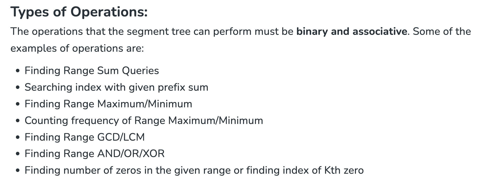

# Segment trees
- General characteristics of segment tree:
  - A segment tree is a binary tree with a leaf node for each element in the array.
  - Each internal node represents a segment or a range of elements in the array.
- For a given array of size n, the maximum number of nodes in the segment tree is 2 * (2 ^ ceil(log2(n))) - 1, which is often approximated as 4n.

- Operations supported by segment trees:
  - 
- persistent segment tree
  - [article](https://www.geeksforgeeks.org/persistent-segment-tree-set-1-introduction/)
  - O(logn) per query
- Merge sort tree
  -  O(log^2) per query

# questions
- For each query (l, r) find the maxiumum prefix sum in arr[l:r+1]
  - [question link](https://www.geeksforgeeks.org/problems/maximum-prefix-sum-for-a-given-range0227/1)
  - Note: the question's way of taking input is wrong as on oct 8th 2024.
  - Solutions:
    - [max_pref.cpp](max_pref.cpp) based on normal segment tree.
- For each query (l, r, k) find number of i such l <= i <= k and a[i] > k
  - [question link](https://www.spoj.com/problems/KQUERY/)
  - Solutions:
    - [effecient code](kqueryEfficient.cpp), O(logn) per query on avarage, offline queries, pre-processing the queries, inspired from comments from [blog](https://codeforces.com/blog/entry/10183#comment-156355)
    - [using merge sort tree](kqueryMergeSortTree.cpp), O(log^2(n)) on average per query on average, online queries.
    - [using persistent seg tree](kqueryPersistent.cpp) , O(logn) time per query on average, online queries.