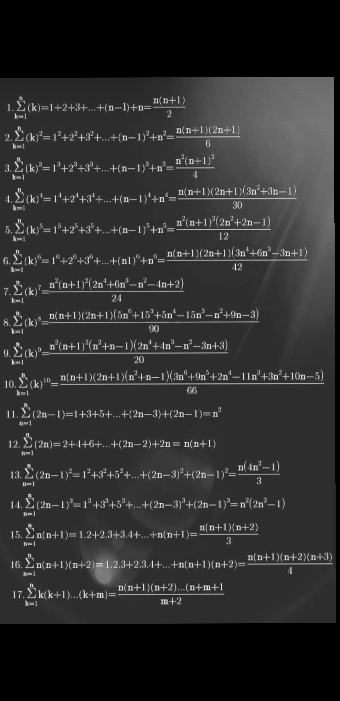

## ✨ Frequently Used Codes

| S.No | Concept | Code | Quick Notes | 
|:--|:--|:---|:---|
| 1️⃣ | Finding the length of a binary format string of a number | [code1.cpp](code1.cpp) | |
| 2️⃣ | Converting numbers in any format (binary, octal, etc.) to decimal | [../C++/string/practise1](../C++/string/practise1) | Uses `stoi()`, `stol()`, `stoll()` for conversion |
| 3️⃣ | Conversion: Binary to Decimal and Decimal to Binary | [../C++/bitset/practise1](../C++/bitset/practise1) | |
| 4️⃣ | GCD and LCM | [euclid_recursive_code.cpp](euclid_recursive_code.cpp), [euclid_iterative_code.cpp](euclid_iterative_code.cpp), [extended_gcd.cpp](extended_gcd.cpp) | **Finding GCD**: Time Complexity: O(log(min(a, b)))   `GCD(a, b) * LCM(a, b) = a * b`   **Euclid's Algorithm**:   `GCD(a, b) = GCD(a - b, b)`   `GCD(a, b) = GCD(a % b, b)` |
| 5️⃣ | Modular Multiplicative Inverse | [modular_multiplicative_inverse.cpp](modular_multiplicative_inverse.cpp) | |
| 6️⃣ | Lucas Theorem | N/A | Useful for finding `(n choose k) % m` when `m` is small and `n` and `k` are large |

## Notes
- **Stirling's Approximation**: 
    - n! ~= sqrt(2 * pi * n) * (n/e)^n
- Sequence and series
    - nth odd number = 2*n - 1
    - Sum of first n positive integers = 1 + 2 + ... + n = n*(n+1)/2
    - Sum of first n squares = 1^2 + 2^2 + 3^2 + ... + n^2 = n*(n+1)(2n+1)/6
    - 

- Sieve of Eratosthenes
  - Given integer ‘n’, print all prime numbers <= n. (similar question: [link](https://leetcode.com/problems/count-primes/description/))
    - Algo 1 (GFG) Normal seive
      - [seive_1.cpp](seive_1.cpp)
      - Time : O(nlog(log(n)))
      - Proof of time complexity: [GFG article](https://www.geeksforgeeks.org/how-is-the-time-complexity-of-sieve-of-eratosthenes-is-nloglogn/)
    - Algo 2: Segmented seive
      - [code](segmented_seive.cpp)
      - Segmented sieve is used for better cache, i.e diving into segments, no difference in time complexity, but running time is possibly less than algo1 because algo1 is not cache favored.
  
- Prime number theorem:
  - Number of primes less than (or) equal to n is =  π(N) ~ n/log(n)
- Euclid's theorem: (wiki)
    - There are infinitely many primes. (Infinitude of primes)
- Betrand’s postulate:
    - For all n >= 1, there exists at least one prime in (n, 2*n]

- Upper bound on number of factors
  - Blog: [link](https://math.stackexchange.com/questions/1699330/upper-bound-on-number-of-factors)
  - Useful bound: Number of factors <= sqrt(3 * x). See the plot of this [here](https://i.sstatic.net/0bWW9.png)

- Harmonic number:
    - [Wiki](https://en.wikipedia.org/wiki/Harmonic_number)
    - H(n) = Sum of reciprocals of first n natural numbers = 1 + 1/2 + 1/3 + … + 1/n 
    - H(n) ~ O (lg(n) + γ) 
    - γ = [Wiki](https://en.wikipedia.org/wiki/Euler%27s_constant)
    - See plot of lg(n) + γ vs H(n): [here](harmonic_number.ipynb)

- Pegion hole principle
- Erodos seekers theorem:
  - [WIKI](https://en.wikipedia.org/wiki/Erd%C5%91s%E2%80%93Szekeres_theorem)
  - In mathematics, the Erdős–Szekeres theorem asserts that, given r, s, any sequence of distinct real numbers with length at least (r − 1)(s − 1) + 1 contains a monotonically increasing subsequence of length r or a monotonically decreasing subsequence of length s. 

## Probability
- Expected value:
  - [Wiki](https://en.wikipedia.org/wiki/Expected_value)

# Math related CP questions
- [Question 1](https://www.codechef.com/problems/LUCMAT)
- [Random NIM problem](https://www.codechef.com/problems/RANDOM_NIM)

-----
## GENERAL MATH USED WHILE CP
- Palindrome checking
  - s[i] = s[(n-1) - i] for 0 base indexing
  - s[i] = s[(n+1) - i] for 1 base indexing